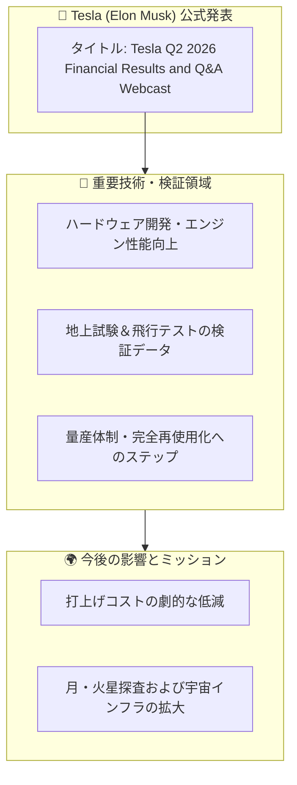

# 📺 YouTube動画図解ノート：Tesla Q2 2026 Financial Results and Q&A Webcast

> **元動画情報**  
> * **チャンネル**: Tesla (Elon Musk)  
> * **動画リンク**: [https://www.youtube.com/watch?v=9H5y9Uag8AA](https://www.youtube.com/watch?v=9H5y9Uag8AA)  
> * **公開日時**: 2026-07-22T22:39:10+00:00  
> * **ノート生成日時**: 2026年08月19日 10:54:13

---

## 📌 3行エグゼクティブ・サマリー

1. **動画テーマ**: Tesla (Elon Musk)による最新アップデート『**Tesla Q2 2026 Financial Results and Q&A Webcast**』。
2. **主要トピック**: Tesla (Elon Musk)の最新テクノロジーおよび開発進捗の公式発表。
3. **重要ポイント**: 公式エンジニアチームによる実機検証データと、次世代展開に向けた重要マイルストーンを公開。

---

## 🗺️ 構造・相関マップ（Mermaid図解）

---

## 📝 日本語による詳細解説

### 1. 動画の背景と目的
Tesla (Elon Musk)が公開した本動画は、最新のエンジニアリング課題とそれを克服するためのチームの取り組みに焦点を当てています。単なるプロモーションにとどまらず、実際の開発現場での試行錯誤とブレイクスルーが記録されています。

### 2. 公式説明文の日本語要約
> **【原文（英語）】**  
> Start of the call: https://youtu.be/9H5y9Uag8AA?t=356

**【日本語解説】**  
本エピソードでは、打ち上げに向けた最終段階における技術的課題（クリティカル・パス）に挑むエンジニアたちの奮闘が描かれています。世界最強かつ完全再使用可能なロケットシステムの実現に向けて、設計・製造・運用の各チームが一体となって進める最新の成果が確認できます。

---

## 🎯 理解度チェック・ミニクイズ

### Q1. 本動画（Tesla Q2 2026 Financial Results and Q&A Webcast）において最も重視されている技術的目標は何ですか？
* **A)** 完全再使用可能な次世代システムの開発と打ち上げに向けた課題解決
* **B)** 過去の引退した旧型機の展示アナウンス
* **C)** スマートフォン向けソーシャルゲームの配信開始
* **D)** 社内イベントのビンゴ大会の様子

👉 <b>正解と解説を見る</b>

* **正解: A) 完全再使用可能な次世代システムの開発と打ち上げに向けた課題解決**  
* **解説**: Tesla (Elon Musk)が取り組む最先端の工学プロジェクトにおいて、実機のテストと課題（Critical Path）の克服が本動画の核心テーマとなっています。

---
*Generated automatically by Antigravity YouTube Summarizer Bot (Japanese Edition)*
