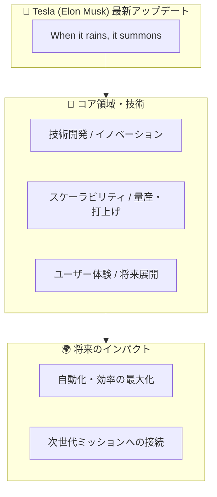

# 📺 YouTube動画図解ノート：When it rains, it summons

> **メタデータ**  
> * **チャンネル**: Tesla (Elon Musk)  
> * **動画URL**: [https://www.youtube.com/shorts/8gvyWy-hCM8](https://www.youtube.com/shorts/8gvyWy-hCM8)  
> * **公開日時**: 2026-07-31T16:31:57+00:00  
> * **自動生成日時**: 2026-08-19 10:49:55

---

## 📌 3行エグゼクティブ・サマリー

1. **トピック**: Tesla (Elon Musk)による最新公式アップデート『When it rains, it summons』。
2. **核心内容**: 技術革新、製品アップデート、および次世代ミッションの最新進捗。
3. **影響**: 業界全体および今後のエコシステム展開における重要マイルストーン。

---

## 🗺️ 構造・相関マップ（Mermaid図解）

---

## 📝 概要と詳細ポイント

### 公式説明文（概要）
公式説明文の記載なし

---

## 🎯 理解度チェック・ミニクイズ

### Q1. 本動画（When it rains, it summons）が扱っているメインテーマは何ですか？
* **A)** Tesla (Elon Musk)の最新技術・製品・ミッションの進捗
* **B)** レトロゲームの攻略法
* **C)** 料理のレシピ紹介
* **D)** 観光地の案内

👉 <b>正解と解説を見る</b>

* **正解: A)** Tesla (Elon Musk)の公式発表・進捗状況を伝える最新動画です。

---
*Generated automatically by Antigravity YouTube Summarizer Bot*
