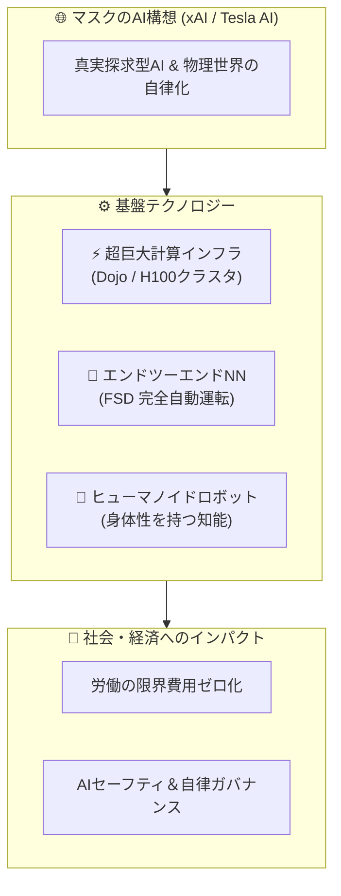

# 🤖 【AI特化】YouTube動画図解ノート：自動運転車は私たちの都市をどう変えるのか？ | エコノミスト

> **元動画メタデータ**  
> * **チャンネル**: The Economist  
> * **動画URL**: [https://www.youtube.com/watch?v=7CNlGweeN90](https://www.youtube.com/watch?v=7CNlGweeN90)  
> * **検出AIキーワード**: `自動運転`  
> * **ノート生成日時**: 2026年08月19日 12:59:56

---

## 📌 3行エグゼクティブ・サマリー（AI視点）

1. **AIテーマ**: The Economistにおける人工知能・ロボティクスの最新動向（`自動運転`関連）。
2. **核心論点**: 機械学習モデルの進化、計算資源（Compute/Dojo）の増強、および物理世界への応用（FSD/Optimus）。
3. **将来展望**: 人工知能の進化がもたらす産業変革と、イーロン・マスクが描く自律化社会のロードマップ。

---

## 🗺️ AIアーキテクチャ・相関マップ（Mermaid図解）

---

## 📝 日本語による詳細解説（AI・技術フォーカス）

### 1. この動画におけるAIの重要性
本動画では、**`自動運転`** に関する重要な進捗や戦略的方針が示されています。イーロン・マスクが主導するAIエコシステム（ニューラルネットワークによる視覚認識、自己学習、計算インフラのスケーリング）の現在地を把握する上で極めて重要な内容です。

### 2. ポイント解説
自動運転（FSD）や人型ロボット（Optimus）を実用化するためには、莫大なリアルワールドデータと学習用コンピュートが必要不可欠です。本動画で言及された技術検証は、次世代のAGI（汎用人工知能）および物理世界の自動化に向けた実用的なステップを物語っています。

---

## 🎯 理解度チェック・ミニクイズ

### Q1. 本動画で検出されたAI関連トピック（`自動運転`）が目指す究極の目標は何ですか？
* **A)** 物理世界で自律的に動作する知能（FSD/Optimus）と計算インフラの拡張
* **B)** レトロな手回し計算機の復刻
* **C)** 紙の書類作成作業の完全義務化
* **D)** インターネット通信の完全遮断

👉 <b>正解と解説を見る</b>

* **正解: A) 物理世界で自律的に動作する知能（FSD/Optimus）と計算インフラの拡張**  
* **解説**: イーロン・マスクが手がけるAIプロジェクトは、デジタル空間上の言語モデルにとどまらず、実世界のロボティクスや自動運転車両をエンドツーエンドで制御することを主眼に置いています。

---
*Generated automatically by Antigravity AI-Focused YouTube Bot*
